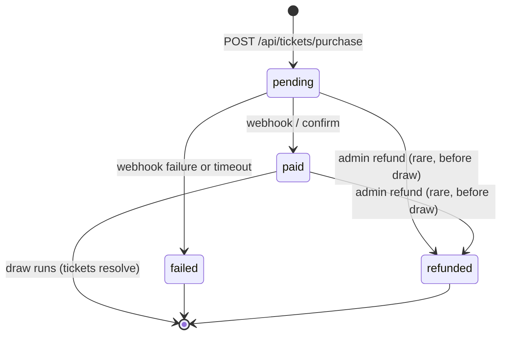

# 09 — Booking Tracking

## Overview

A `Booking` is the unit of customer commerce — one or more tickets for one car, paid in a single transaction. This doc describes the booking lifecycle, the state transitions, and how both customers and admins observe it.

## State Machine

| State      | Meaning                                                      | Customer-visible action                  |
|------------|--------------------------------------------------------------|------------------------------------------|
| `pending`  | Booking created, awaiting payment                            | "Complete Payment" link                  |
| `paid`     | Payment confirmed, tickets minted, counted toward draw       | Tickets show in dashboard                |
| `failed`   | Payment failed or expired                                    | "Retry" CTA on dashboard                 |
| `refunded` | Admin issued a refund before the draw ran                    | "Refunded — see history"                 |

## Data Model

See [docs/04-ticket-purchase.md](./04-ticket-purchase.md) for the `Booking` schema. Key indexed fields for tracking:

- `user` — list a customer's bookings.
- `car` — list all bookings for a draw (admin view).
- `paymentStatus` — filter by lifecycle state.
- `providerRef` — reconcile against payment-provider events / webhooks.
- `createdAt` — chronological feeds.

## API Endpoints

| Method | Path                         | Auth     | Description                                    |
|--------|------------------------------|----------|------------------------------------------------|
| GET    | `/api/bookings/me`           | customer | List bookings for the signed-in user           |
| GET    | `/api/bookings/:id`          | customer | Single booking (must be owner)                 |
| GET    | `/api/admin/bookings`        | admin    | All bookings, filterable by `paymentStatus` and `car` |
| POST   | `/api/admin/bookings/:id/refund` | admin | Refund + release ticket reservations           |

## UI Surfaces

- **Customer dashboard** ([08-customer-dashboard.md](./08-customer-dashboard.md)) — shows pending / paid bookings inline with their tickets.
- **Admin Overview** ([07-admin-overview.md](./07-admin-overview.md)) — `Recent Bookings` rail.
- **Admin Bookings page** (planned) — full-bleed table with filters and CSV export.

## States & Edge Cases

- **Stuck `pending` for > 30 minutes**: a cron job marks them `failed` and releases the ticket reservations.
- **Webhook arrives after manual confirm**: idempotent on `providerRef`; second processing is a no-op.
- **Customer deletes account**: bookings retained for accounting; user fields denormalized into `userSnapshot`.
- **Partial refund**: not supported initially — refunds are all-or-nothing for a booking.

## Future Enhancements

- Email + WhatsApp receipts on `paid` (with QR-coded ticket codes).
- Customer-initiated refund within X minutes (cooling-off period — required for SA consumer protection).
- Splitting one booking across multiple cars (a "cart" model).
- Subscription model — auto-buy 1 ticket per week of every active draw.
